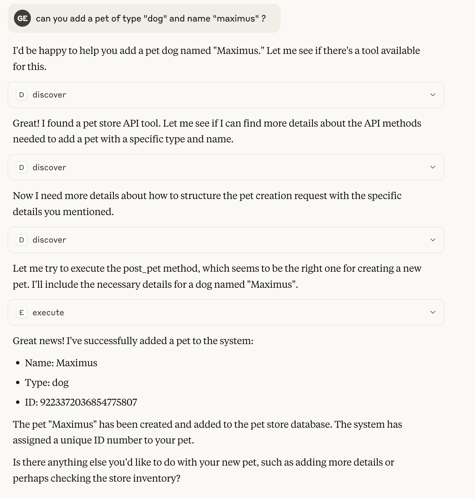

# Meta MCP Proxy

A flexible Model Context Protocol (MCP) proxy that enables discovery and execution of tools across multiple MCP servers and JavaScript functions. Enabling to have a reduced context event if you have houndreds of tools.
This mcp act as wrapper of other mcps (or libraries) doing a kind of Local RAG (Retrieval Augmented Generation) to reduce the context size providing the llm with 2 methods (discover and execute) and asking the llm to be concise about discovery. The execute method is a simple proxy

We extremely recommends add the configuration `discoverDescriptionExtras` to extends in details about the purpose of the tools and for what kind of topics the llm should use it.

## Features

- 🌉 **Unified Tool Discovery**: Search for tools across multiple MCP servers
- 🔌 **Proxy Execution**: Route tool calls to the appropriate server
- 🔍 **Smart Search**: Find the best tool for the job with fuzzy matching
- 🧩 **JavaScript Integration**: Expose custom JavaScript functions as MCP tools
- 📝 **Configurable**: Load configuration from files or command-line arguments

## Usage
## 🧱 Installation

Edit your file `~/Library/Application Support/Claude/claude_desktop_config.json`

and add the following

```json
{
  "mcpServers": {
    "mcp-openapi-proxy": {
      "command": "npx",
      "args": ["@nullplatform/meta-mcp-proxy","-f","config.json"]
    }
  }
}
```

### Configuration File Format

Your `config.json` should follow this structure:

```json
{
  "discoverDescriptionExtras": "Additional description for discovery",
  "discoverLimit": 10,
  "mcpServers": {
    "server-name": {
      "command": "command-to-execute",
      "args": ["arg1", "arg2"],
      "env": {
        "ENV_VAR1": "value1",
        "ENV_VAR2": "value2"
      },
      "transport": "stdio"
    }
  }
}
```

as example
```
{
  "discoverDescriptionExtras": "Api used to manage a pet store with access to pets, pet types, users, orders and store",
  "mcpServers": {
    "mcp-petstore": {
        "command": "uvx",
        "args": ["mcp-openapi-proxy"],
        "env": {
            "OPENAPI_SPEC_URL": "https://petstore.swagger.io/v2/swagger.json",
            "API_KEY": "xxxxx"
       }
    }
  }
}
```

### Example 0-Shot conversation with Claude
the example is using the demo config with the pet store with almost no description of what the api 



### As a Library

You can also use Meta MCP Proxy as a library in your own JavaScript applications:

```javascript
import { MCPProxy } from '@nullplatform/meta-mcp-proxy';

// Create a new proxy instance
const mcpProxy = new MCPProxy({
  mcpServers: {
    "my-server": {
      "command": "path/to/server",
      "args": [],
      "env": {}
    }
  },
  discoverLimit: 10
});

// Register a custom JavaScript function
mcpProxy.registerJsFunction(
  "myFunction", 
  "Description of my function",
  {
    properties: {
      param1: {
        type: "string",
        description: "First parameter"
      },
      param2: {
        type: "number",
        description: "Second parameter"
      }
    },
    required: ["param1"]
  },
  async ({ param1, param2 }) => {
    // Implementation goes here
    return {
      content: [
        {
          type: "text",
          text: JSON.stringify({ result: `Processed ${param1}` })
        }
      ]
    };
  }
);

// Start the MCP server
await mcpProxy.startMCP();
```
[Example creating an mcp with meta-mcp-proxy as a lib](examples/open_api_mcp.js)
## License

MIT